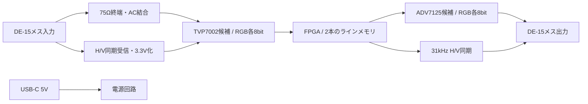

# 設計仕様 v0.1

## 信号経路

## 動作範囲

| 入力 | 出力方針 |
|---|---|
| 15kHzプログレッシブ | 各入力ラインを2回出力。垂直周波数は維持 |
| 15kHzインターレース | 各フィールドを独立して倍化し、フィールドごとに出力フレームを開始 |
| PAL | 水平周波数は入力の2倍、概ね31.25kHz |
| NTSC | 水平周波数は入力の2倍、概ね31.47kHz |
| 起動・同期喪失・モード変更 | 映像を消し、安定した同期を再取得してから再開 |

Amigaの非インターレース走査線数、オーバースキャン、長短ラインは標準TVタイミングと一致するとは限らない。入力に追従する出力を基本とし、480p/576pの固定規格タイミングと同一とは保証しない。GW2780でPALが表示できるという利用者の情報は前提として尊重するが、この回路が生成するVGA入力タイミングは試作で確認する。

## ライン処理

入力の1ラインをN画素として取得し、次の入力ラインを取得している間に、直前のラインを2倍の画素クロックで2回読み出す。1ラインの読み出し時間は入力ライン時間の半分。

- 画素形式：RGB888。HAM8を含め、入力で既にRGBになっている色をそのまま標本化する。
- メモリ候補：最大2048画素×24bit×2本＝98,304bit（12KiB）。フレームメモリなし。
- 入力サンプルクロック候補：約28～32MHz帯。AGA SuperHiresを考慮し、14MHz以下への固定は避ける。
- 出力クロック：入力サンプルクロックの厳密な2倍、FPGA内PLLで生成。
- 実際のN、ADC位相、クランプ窓は実入力に合わせる。試験で使う1816/1820は暫定検討値であり、PAL/NTSCの完成設定値ではない。
- PLLロック、ADCデータの取り込み位相、入出力のsetup/hold、メモリ推論結果を確定してから配線と端子配置を固定する。

## 遅延の計算

入力1ライン時間をHとする。先行ラインを蓄積する方式では、画素位置によって1回目の出力の遅延は約0.5H～H、2回目は約H～1.5Hとなる。H≒64µsの場合、約32～96µs。これにADC/DACとFPGAのパイプライン遅延を加える。

基板単体0.2ms以下は設計目標であり、未測定。LCD内部処理の遅延は別。信号切替時の再ロック時間は定常時の画素遅延とは別に測定する。

## インターレース境界

半入力ラインは1出力ラインに相当する。フィールド開始イベントを1入力ライン遅延し、出力ライン境界で垂直同期を開始する。奇偶の2フィールドを合成しない。

`field_sync.sv`は既に正規化されたイベントを受ける。生のVSYNCのパルスをそのままメモリで繰り返す方式は使用しない。VSOUTの遅延とADCのRGB遅延を整合する前段は未実装。合成した垂直同期と出力RGBの境界を一緒に検証する必要がある。

ちらつき・上下の揺れはBob方式の特性として残る。前フィールドを参照する処理は追加しない。

## 電源

USB-Cの5V入力を基本とする。CC1/CC2にはそれぞれ独立した5.1kΩのRdを設ける構成を検討。これは5V給電を成立させるもので、大電流の無条件許可ではない。

TVP7002は3.3Vと1.9Vを必要とする。FPGAのLV型を採用する場合はコア用1.2V、I/O用3.3Vを検討。DACは3.3V。5Vから各電源を生成し、ADC/PLL/DACの電源を適切にフィルタリングする。

暫定的に5V/1A以上のUSB電源アダプターを想定するが、電流仕様は未確定。USB-Cから1.5Aの供給広告を検出して起動する方式ならPCのUSB-Cポートでも条件を明確化できる。PCのUSB-Aポートから列挙なしで500mAを無条件に取る仕様にはしない。USB-A充電器を含めるか、USB-C給電条件を限定するかは電力計算後に固定する。

## 基板

4層、部品は原則上面、L2は連続したGND面。入力RGBはADC付近まで短く、出力DACは出力端子付近に配置。RGB配線は選定したJLCPCB積層に合わせて75Ωを検討。ADC/DACのクロックをRGB入力やPLLフィルターから離す。

D-SUB信号端子のSMT対応と固定脚の実装方法は、実部品の図面で確定する。2列15ピン部品を誤採用しない。未選定のコネクターを汎用フットプリントだけで発注しない。

## 必要な制御

ADCは電源投入だけでは目的のRGB変換設定にならない。FPGAのI²C制御で電源安定待ち、リセット、入力MUX、RGB出力形式、PLL、ゲイン、オフセット、クランプを初期化する。追加MCUを省き、FPGA内制御を第一案とする。書き込み・調整用JTAGパッドを確保する。

参考： [TI TVP7002](https://www.ti.com/product/TVP7002)、[ADI ADV7125](https://www.analog.com/en/products/adv7125.html)、[GOWIN LittleBee](https://www.gowinsemi.com/en/product/littlebee_fpga/)。
