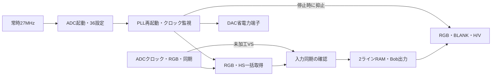

# 機能回路の全体接続 v0.11

2026-09-12。`amiga_logic_core` にADC起動、クロック再起動・監視、画素取り込み、入力同期、ライン倍化を接続した。端子割り当て済みの基板用トップ回路ではない。

## 接続した流れ

ADCが設定済みという許可からPLL取得を開始する。クロック監視が準備できたら入力取得のリセットを解除し、画素と同期が揃ってから映像を出す。入力同期の状態は2段同期で27MHz側へ戻し、状態出力 `video_ready_ref` に反映する。

各画素の出力許可は、映像クロック側の有効信号とクロック監視から直接判断する。遅れて戻ってくる27MHz側の状態出力を、画素ごとの出力切替には使わない。クロック停止中でも、監視側からRGB/BLANK/H/Vの出力抑止とPSAVE制御を行う。

## 外側に必要な処理

| 項目 | 今回の境界 |
|---|---|
| rPLL | `pll_reset` を出し、外側から `video_clock` と `pll_lock` を受ける。v0.9の候補プリミティブを実装ツールで接続・検証する必要がある |
| ADC入力 | 回路図のRGB[9:2]・HS・VS・DATACLKを接続する。入力遅延とクロック経路の確認は未完了 |
| I²C | Low駆動要求と端子読み戻しを受け渡す。実端子はLowまたは高インピーダンスにする |
| リセット | 明示的な `reset` 入力が必要。FPGA設定完了時の電源投入リセット生成は未実装 |
| DAC | RGB/BLANK/H/V/PSAVEの論理信号まで。DACクロックの転送回路と相対位相は未実装 |
| 入力設定 | H_SAMPLES・表示窓・VS位置を明示指定。PAL/NTSCの自動判定・切替は未実装 |

## 全体試験

ADCのI²C端子を観測するモデルで、最初の出力無効化、36件の送信、最後の出力有効化を確認する。モデルは最後の有効化書き込みが届くまでADCクロックを出さない。その後、ADCクロック、RGB、HS、625半ライン周期のVSを供給し、取り込みから出力までを動かす。

試験したのは、初回起動、ADCクロック停止時の出力抑止、停止後に色を変えてからの復帰、電源断、再起動時のアドレスNACKによる停止と診断出力。記録は `system_simulation_report.txt`。

H_SAMPLES=1536、入力クロック約27.78MHz、625半ラインという機能確認用の組み合わせ。AmigaのPAL完成プロファイルではない。表示窓や各種待ち時間も試験用に設定した。RGBは非対称な固定色ABCDEFと123456を使う。画素ごとの位置・内容の照合は既存の前段・映像処理試験で別途行っており、今回の試験を全画面タイミングの独立照合として扱わない。

PLL本体は理想2倍クロックとLOCK応答モデルで置き換えている。DACのアナログ出力、PSAVEの実際の消画性能、PLLのロック特性を確認した試験ではない。

## 試験中に見つかった初期化条件

最初の試験では、ADCクロックが停止している間にリセットの初期値だけを置いたため、ADC側カウンターが不定値のまま残り、取得が始まらなかった。試験を、停止中にresetを0から1へ明示的に立ててから解除する形へ修正した。これにより、クロックがない状態での非同期リセットも試験する。

この修正は試験モデルの初期化修正であり、基板側の電源投入リセットを実装したことにはならない。実機でのGSR・初期レジスター状態と外側のreset生成を確認する必要がある。

## 未完了

v0.12で今回の統合回路を含む合成を実施した（`system_synthesis.md`）。配置配線・CDC・タイミング確認は未実施。全体が選定FPGAへ収まると確定したものではない。

基板用トップ、電源投入リセット、実PLL、DACクロック、レジスター読み戻し、VS位置の校正、長短ラインの連続表示への対応が残る。基板は95×95mm・135部品・129ネットの未配線配置案で、製造データは未完成。

## v0.13追記

基板トップ、起動リセット、実PLL・DDR出力の接続候補を追加し、DACクロックの端子を修正した。`board_integration.md` を参照。上記の合成・機能試験は元の機能回路の範囲であり、新しい基板トップの実装確認ではない。
